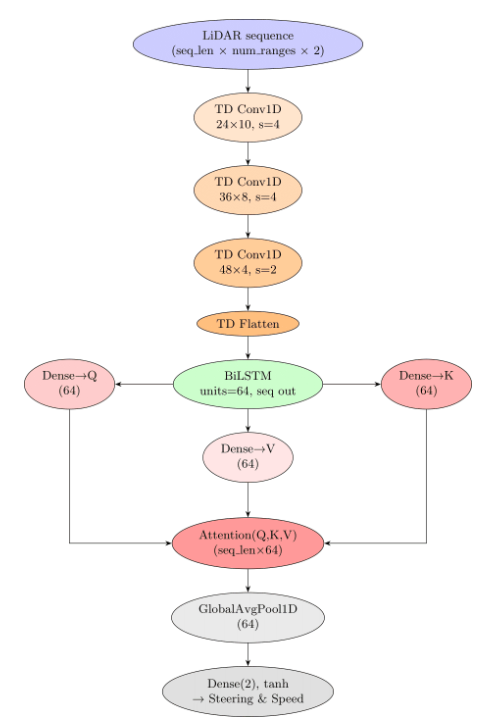

#  F1TENTH Autonomous Racing: Recurrent LidarNet


## Overview

This project introduces **Recurrent LidarNet (RLN)** — a temporal-aware, deep learning architecture for autonomous racing on the F1TENTH platform. RLN leverages sequential 2D LiDAR data using a combination of convolutional, recurrent, and attention mechanisms to enhance spatial-temporal perception and improve driving control.

The repository includes all code, trained models, and datasets required to reproduce results and experiment with the RLN framework.


## Key Features

- **Recurrent LidarNet Architecture**: Combines 1D convolutions, bidirectional LSTM, and attention to extract robust temporal features from LiDAR sequences.
- **End-to-End Learning**: Predicts steering and velocity commands directly from raw LiDAR data.
- **Baseline Comparison**: Includes both RLN and TinyLidarNet (TLN) for benchmarking.
- **Reproducibility**: Contains scripts and configuration files for training, evaluation, and data collection.

---

## Usage

### Data Collection

Use the following script to collect driving data from the F1TENTH platform:
```bash
python data_collection.py
```

---

### Training

Train RLN or TLN models with:
```bash
python train.py
```


---

### Inference

Evaluate a trained model on test data:
```bash
python inference.py
```
be sure to give the correct path.

---

## Results

### Training & Validation Loss


- RLN achieves lower and more stable validation loss than TLN, indicating improved generalization and reduced overfitting.

---

### Network Architecture



- RLN processes sequences of LiDAR scans using:
  - 1D Convolutional layers
  - Bidirectional LSTM
  - Attention mechanisms
  - Fully connected layers for control outputs

---


